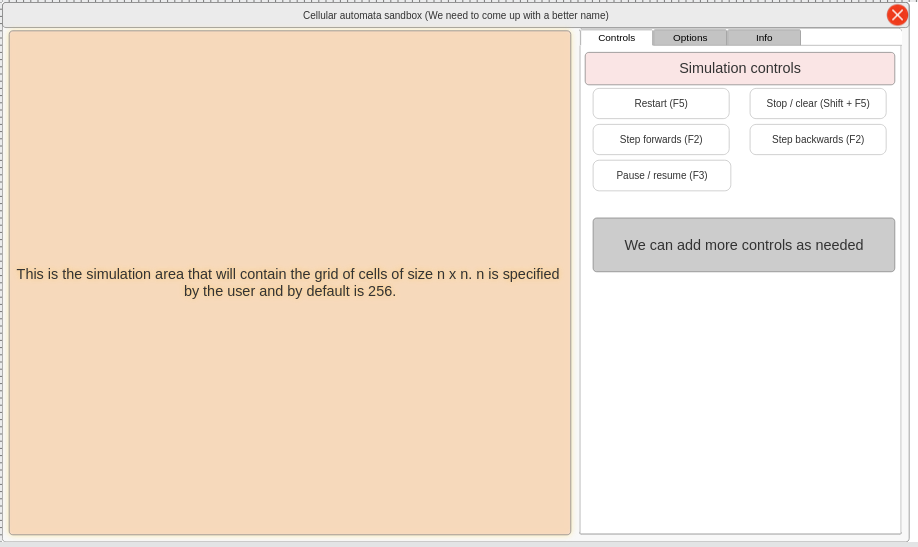
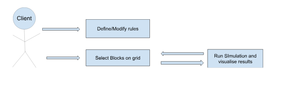
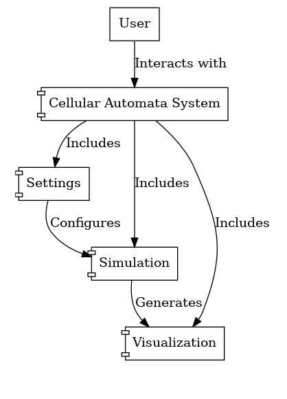

---
output:
  pdf_document: default
  html_document: default
---
# Description of the Application Domain

> ### Why cellular automata?

-   Understand how apparent complexity and unpredictability can arise over time from extremely simple rules and limited states.

-   Understand the limits of computation and whether some problems can only be solved by running a complete simulation.

-   Understand the patterns that we see in nature.

-   Approach the P vs NP problem in theoretical computer science.

> ### Conway’s game of life

> > The Game of Life is a cellular automaton created by the mathematician John Conway in 1970. It simulates the progression of a grid of cells following a few rules that mimics the way the natural world operates. These rules lead to the development of complex patterns over time. The term “life” in the simulation represents cells that can be born, die, or survive depending on their neighbouring cells

> > The application domain involves mathematical modeling and simulations, often applied to fields like computer science and artificial life research. It also serves as a valuable education tool for studying topics such as cellular automata, pattern formation, and chaos theory.

The game has a couple predefined rules:

1.  A cell is born if it has exactly 3 neighbours\
2.  A cell survives if it has 2 or 3 neighbours\
3.  A cell dies if it has fewer than 2 or more than 3 neighbours

> ### Wolfram’s 1D Cellular Automata

> > One of the major voices in the field of cellular automata has been Stephen Wolfram and his work on classifying the behavior of 1D cellular automata. They are as follows:

1.  Homogeneous: a rapidly converging CA where all the cells eventually have the same state and remain like that.

2.  Patterned: CA that converges to either stable states or simple repeating patterns.\

3.  Chaotic: Display unpredictable behavior where slight modifications to the initial conditions cause major changes to the outcomes.\

4.  Complex: Creates local structures that interact in sophisticated ways. These CAs are particularly interesting because they are computationally universal.

> ### Promise of Cellular Automata research
>
> > Due to their complex behavior from simple rules cellular automata have assisted the study of many disparate fields all attempting to understand various forms of complexity. So there are plenty of new discoveries to be had in the research field of CAs and many more applications to be made from the existing research.

> #### Real applications of CAs

-   Genetics
      - Search for "good" genetics. What sets of initail conditions given a well defined repoduction rules will give rise to emergent behavior
      - The famous genetic algorithm can be applied to the evolution of cellular automata. In short genetic algorithms search in intractable spaces for optimizations of a certain function.
      - In 2006 NASA used an evolutionary computer to solve for the best shape of antenna for a specific radiation pattern.
-   Study of Chaos & information theory
      - Binary string compression

-   Study of emergence

-   Convolutions and image processing
    - A rule can be though of as a convolution. A function that takes a perhipheral and computes a certain value. 

-   Statistical physics
    - Snowflake formation
    - Lattice boltzmann method was inspired by cellular automata

-   Chemistry

> > Really any problem that can be discretized and defined as the small discretization cells interacting with each other by some fixed function called a rule. 

> #### Purpose
>
> > Provide the academic researchers, students, or teachers a simple and easy tool to perform rapid experiments with cellular automata and how emergence can arise from setting simple interaction rules and initial conditions. This tool will make CAs more accessible to more people. Our application will allow theoretical ideas about complexity to be easily simulated and explored. Our aim is to make Cellular Automata research more tangible.

# Requirements

> ## Functional
>
> > ### What the system should do
> >
> > -   ***Initialization:*** The system should allow the user to define the initial state of the grid
> >
> > -   ***Evolution:*** The system should update the grid at each step, following the predefined rules to determine whether the cells survive, die, or are born in the next generation
> >
> > -   **Visualization:** The system should display the grid and the evolution of the cells in a clear user-friendly way, showing the changes from one generation to the next
> >
> > -   **Pause/Resume:** The system should allow users to pause and resume the evolution process at any point
> >
> > -   **Speed Control:** The system should allow users to control the speed at which the grid evolves, either by manually stepping through generations or automatically advancing at a set pace.
> >
> > ### Inputs (settings and options)
> >
> > -   **2D or 1D:** an option to select a 1D or 2D grid
> > -   **Initial State:** The user should have the option to either:
> >     -   Randomize the initial configurations of the cells
> >     -   Manually initialize specific cells to be alive
> >         -   **Speed of Evolution:** The user can choose how fast or slow the grid evolves, adjusting the time interval between generations
> >         -   **Cell Display:** option to select whether you want cells to be display as black (alive) and White (dead) or 1 (alive) or a 0 (dead)
> >
> > ### Outputs
> >
> > -   **State Grid:** The primary output is a grid of cells, each in a s specific state
> >
> > -   **Pattern:** Over time, the CA can produce various patterns, such as still lifes, oscillators, and spaceships.
> >
> > -   **Statistics:** Metrics like the number of active cells, pattern frequencies, and other statistical data.
> >
> > ### Computation
> >
> > -   State Transition Rules : The core computations involve applying rules to determine the next state of each cell.
> >
> > -   Neighborhood Analysis : For each cell, the states of its neighboring cells are analyzed to apply the transition rule.
> >
> > ### Data
> >
> > -   **Initial Configuration:** The starting state of the grid, which can be random or a specific pattern.
> >
> > -   **Rule Set:** The set of rules that define how cells transition from one state to another.
> >
> > -   **Time step:** The sequence of grid states over time, which can be stored for analysis or visualization.
>
> ## Non-functional
>
> > ### Hardware constraints
> >
> > -   **Memory Requirement:** Cellular automata need substantial memory to store cell states. At least 2 gigabytes of cell state memory using dynamic RAM. If each state has multiple states,more memory is needed per cell.
> >
> > -   **Processing Power:** The system requires significant processing capabilities to handle parallel computations. Eg - ½ gigabytes of look up table memory using 35 -ns static RAM.
> >
> > -   **Graphics Processing:** For visual simulations, a cable graphics card is necessary. Eg - required at least an AMD Radeon R5 graphics card.
> >
> > -   **CPU requirement:** The complexity of cellular automata simulations demands a powerful CPU . One system specified a minimum of an Intel Core i5 .
> >
> > -   **Storage:** Cellular automata simulations require significant storage space. One system had a file size requirement of 4GB.
> >
> > ### Software constraints
> >
> > -   **Memory Management:** Efficient memory management is crucial to handle the large amounts of data generated by cellular automata. This includes efficient data structures to store cell states.
> >
> > -   **Use Interfaces:** A user - friendly interface is important for simulations, visualizing results, and adjusting parameters. Eg - graphical user interfaces (GUIs).
> >
> > -   **Parallel processing Support:** A proper software is needed to leverage parallel processing capabilities, such as multi - threading or GPU acceleration.
> >
> > -   **Scalability:** The software should be scalable to handle different sizes of cellular automata grids, from small-scale to large scale ones.
> >
> > -   **Compatibility:** The software should be compatible with various operating systems and hardware configurations to ensure board usability.
> >
> > -   **Error Handling:** Robust error handling mechanisms are necessary to manage unexpected issues during simulations.
> >
> > -   **Compatible Operating systems:**
> >
> >     -   \>= Mac OS X 10.0
> >
> >     -   \>= Windows 10
> >
> >     -   \>= Linux 5.0
> >
> > ### Time / resource constraints
> >
> > -   **Computation time:** The time required to update the state of each cell can be significant.
> >
> > -   **Data transfer:** In distributed systems, the time and resources required to transfer data between different processing units can be constrained. Optimizing data transfer protocols can help mitigate this issue.
> >
> > ### Reliability
> >
> > -   **Crash handling:** The request to evaluate more sophisticated rules for many cells can quickly compound into a daunting task especially when the grid needs to be updated multiple times a second. If we detect the number of computations per step is too high we must either refuse to run, or run at a limited frame rate to prevent a program crash.
> >
> > -   **Memory Management:** Make sure there are no memory leaks, even the smallest leak will eventually cause a crash. Since there are many states to be stored and updated, care during implementation must be taken to use memory efficiently.
> >
> > ### Usability
> >
> > -   **Target users:** Students, teachers, or researchers with at least moderate experience using technology.
> >
> > -   **Organization:** The state grid will always be visible since that is the most prominent part of the application. All other options, controls and settings will be organized neatly into tabs within a tool section.
> >
> > ### Maintainability
> >
> > -   **Modularity:** Cellular automata inherently have a modular structure, with each cell functioning as an independent unit.This modularity can enhance maintainability by allowing for easier isolation.
> >
> > -   **Testability:** The discrete nature of cellular automata makes them amenable to unit testing.
> >
> > -   **Complexity Management:** While cellular automata can code complexity systems, their rule- based nature can make it challenging to maintain and debug large scale simulations.
> >
> > ### Programming language and libraries
> >
> > #### Programming Language(s):
> >
> > -   Java
> >
> > #### Potential GUI Libraries:
> >
> > -   Java swing : This is a built in java library that provides a set of GUI components for creating graphical user interfaces. It’s widely used and can be employed to render cells and create interactivity.
> > -   JavaFX : A modern GUI framework for java application that offers improved performance and richer set of UI. It can be used to create more visually appealing and interactive CA.
> > -   jTrend : A java based cellular automata simulation environment that includes its own GUI components.
> > -   libGDX : A framework for a game development framework, libGDX can be utilized for cellular automata visualization .

# Application Usage and Overview

>
> ## Tabs Description:
> 
> ### Parameters
>
> > Contains all interactive widgets for running, stepping through and setting the simulation. All of the configuration specific to the operation of the simulation will happen here. These settings include:
> > - Grid size
> > - Simulation speed
> > - Cell formatting
> > - CA dimensionality specification
> > - Runtime interactions (run, start, pause, next, previous)
> > - Rule settings 
>
> ### Visualization
>
> > Contains aesthetic settings about how to to format and view the grid. Any setting here will not change the function of the simulation, only the way it appears. Here features like cell format, and color schemes can be set.
>
> ### Statistics
>
> > Contains statistics and general info about the simulation. The number of cells in each state, step number, amount of state change after each step and more sophisticated statistics about how the CA has changed over many iterations. These statistics are of utmost importance to the product as they give the researcher rigourous numerical insights about the CA. 
>
> ### Import / Export
> 
> > Once researchers discover an interesting rule or set of initial conditions they may want to save or share that result. This tab allows for simple importing and exporting of setting and initial condition configurations. Also connected to an imported / exported rule are any relevant runtime statisics up to the step when it was exported.
>
> ## Step-by-step usage:
> > 1. In parameters set the dimensionality of the CA. Do you want 1D, 2D or some other more sophisticated state options?
> > 2. Set the grid size. This must remain fixed throughout the duration of the simulation.
> > 3. Select a pre-defined rule set or create your own custom rules.
> > 4. Set your initial conditions by either randomizing, using a pattern, or manually selecting the state for each initial cell in the grid.
> > 5. Set your color scheme and customize the appearance.
> > 6. Set the simulation speed (this can be changed at any time in the simulation)
> > 7. Start the simulation. This will reset all the statistics to their initial values.
> > 8. Watch the simulation run, or pause, resume, and step through the simulation.
> > 9. Analyze the statistics. Perhaps they might surprise you in some way.
> > 10. Once you find a notable rule / initial condition set save / export that rule, share it with colleagues, or include it in your research.
> 

# Business model
> ### Product Purpose:
>
> > A software platform that has a user-friendly interface for setting up and running one dimensional cellular automata simulations. Users can define custom rules and select starting blocks within a one dimensional grid and then simulate the system. The software has a visual dashboard that displays the simulation progress. The goal of the software is to provide an accessible research and learning platform for cellular automata by displaying simulations created by the user.
>
> ### Target Users:
>
> > The target user base of the application is grounded in students/professors, researchers/scientists and enthusiasts actively working in the field or just curious seeking a simple sandbox for playing with Cellular Automata.
>
> ### Software compatibility:
>
> > Available for download for Mac, Windows, and Linux users
>
> ### Scheduled Release Date:
>
> > April 4th 2025

# UML Usage Diagrams

# Glossary

-   **State:** A single discrete selection of a value from a finite set of values.
-   **Cell:** A single distinct location that can be assigned a state.
-   **Rule:** A function that takes a cell's neighbourhood states as inputs and outputs a new state value.
-   **Step:** A single iteration where each cell is evaluated and updated according to the predefined rules taking the prior step.
-   **Cellular automata (CA):** A collection of discrete cells which are allowed to evolve in a step wise process according to a set of rules defining the way a cell's neighbourhood updates its state in the next step.
-   **1D CA:** Each rule only considers its horizontal neighbours as inputs for the next step. These are typically represented in a 2D grid where each line is a step in the CA.
-   **2D CA:** The domain of a rule is both horizontal and vertical. When the rules for 2D CAs are evaluated the cell is updated in place rather than adding a new line to the simulation.
-   **Emergence:** A phenomenon where complex and interesting patterns or behaviors arise from simple, local interactions between cells
-   **Chaos Theory:** A branch of mathematics and science that deals with systems that appear to be random or unpredictable, even though they are governed by deterministic laws. It’s a study of complex systems where small changes in initial conditions can lead to vastly different outcomes.
-   **Evolve:** The process where grids update over time, with cells changing based on the predefined rules of the game
-   **Neighbours:** The surrounding cells that influence the state of a given cell
-   **Generation:** A single update in the grid’s state, where each cell is recalculated based on the predefined rules of the game
-   **Oscillator:** A pattern that returns to its original state after a fixed number of generations
-   **Glider:** A special pattern that moves across the grid over time, it is made up of a small group of cells that travel from one place to another, repeating and maintaining its shape as it moves
-   **Computationally universal:** A machine or process able to compute anything that any other computer can compute.
